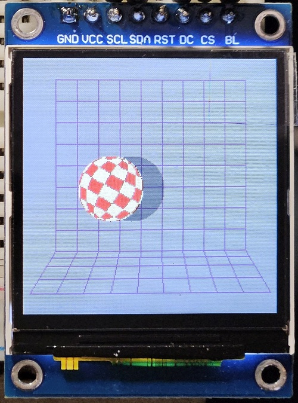
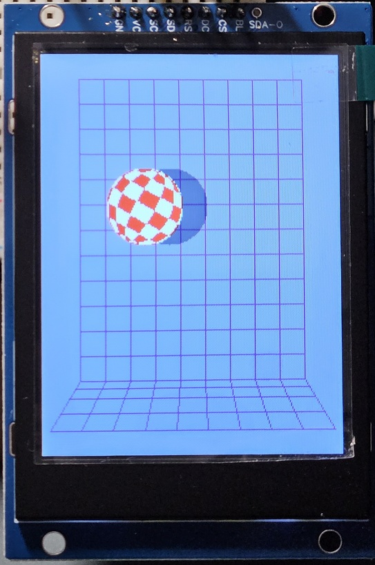
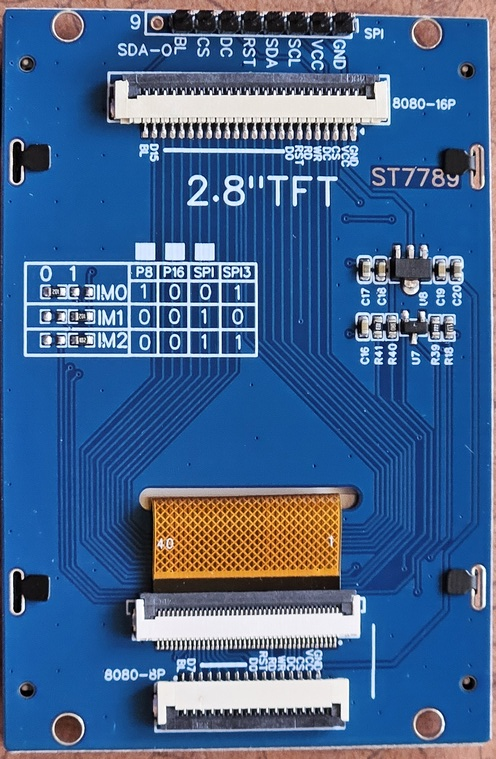

[![license-badge][]][license] ![version]  ![hit-count] [![github-issues][]][issues]

# ST7789_AVR
Fast SPI library for the ST7789 IPS display optimized for AVR Arduinos

**Replaces obsolete Arduino_ST7789_Fast:** https://github.com/cbm80amiga/Arduino_ST7789_Fast

Significantly optimized for 16MHz **AVR Arduino boards** (2.5-5x faster than other libraries).

Achieved 7.1Mbps SPI transfer rate (at DIV2/16MHz clock).

In compatiliblity mode it **should** work with other MCUs, but I didn't test all configurations.

For STM32 (BluePill) there is separate optimized version here: https://github.com/cbm80amiga/Arduino_ST7789_STM

## YouTube video: ##

https://youtu.be/GciLKcWQZK4

YouTube playlist with all videos related to ST7789:

https://www.youtube.com/playlist?list=PLxb1losWErZ7thUyB05phRR3DoiYN_kcD

## Configuration

Use **#define COMPATIBILITY_MODE** - then the library should work on all Arduino compatible boards

Remove above define for the best performance on 16MHz AVR

Use **#define CS_ALWAYS_LOW** for LCD boards where CS pin is internally connected to the ground, it gives better performance

Tested with **Arduino IDE 1.6.5 and Adafruit_GFX 1.5.6**

## Extra Features
- invertDisplay()
- sleepDisplay()
- enableDisplay()
- idleDisplay() - saves power by limiting colors to 3 bit mode (8 colors)
- resetDisplay() - software reset
- partialDisplay() and setPartArea() - limiting display area for power saving
- setScrollArea() and setScroll() - smooth vertical scrolling
- fast drawImage() from RAM
- fast drawImage() from flash (PROGMEM)

## Tested displays:
- 240x240 1.3" IPS (without CS pin)
  
  

- 240x240 1.54" IPS (with CS pin)

 

- 240x280 1.69" IPS

  

- 170x320 1.9" IPS

  

- 240x320 2.0" IPS

  

- 240x320 2.8" IPS

 

## Connections:

Without CS (1.3" only), use **CS_ALWAYS_LOW**

|LCD pin|LCD pin name|Arduino|
|--|--|--|
|#01| GND| GND|
|#02| VCC |VCC (3.3V only!)|
|#03| SCL |D13/SCK|
|#04| SDA |D11/MOSI|
|#05| RES |D9 or any digital|
|#06| DC  |D10 or any digital|
|#07| BLK |NC|

With CS (1.69", 1.9", 2.0"), don't use **CS_ALWAYS_LOW**

|LCD pin|LCD pin name|Arduino|
|--|--|--|
|#01| GND| GND|
|#02| VCC |VCC (3.3V only!)|
|#03| SCL |D13/SCK|
|#04| SDA |D11/MOSI|
|#05| RES |optional|
|#06| DC  |D10 or any digital|
|#07| CS  |D9 or any digital|
|#08| BLK |VCC|

If you find it useful and want to buy me a coffee or a beer:

https://www.paypal.me/cbm80amiga

[license-badge]: https://img.shields.io/badge/License-GPLv3-blue.svg
[license]:       https://choosealicense.com/licenses/gpl-3.0/
[version]:       https://img.shields.io/badge/Version-1.1.0-green.svg
[hit-count]:     https://hits.seeyoufarm.com/api/count/incr/badge.svg?url=https%3A%2F%2Fgithub.com%2Fcbm80amiga%2FST7789_AVR&count_bg=%2379C83D&title_bg=%23555555&icon=&icon_color=%23E7E7E7&title=hits&edge_flat=false
[github-issues]: https://img.shields.io/github/issues/cbm80amiga/ST7789_AVR.svg
[issues]:        https://github.com/cbm80amiga/ST7789_AVR/issues/
